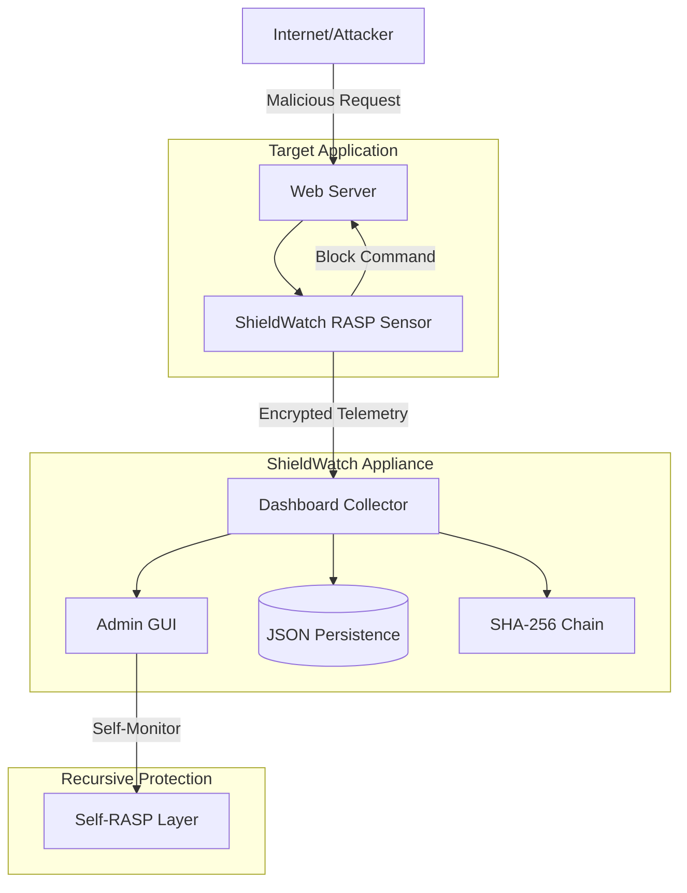
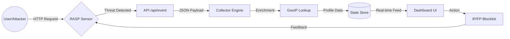
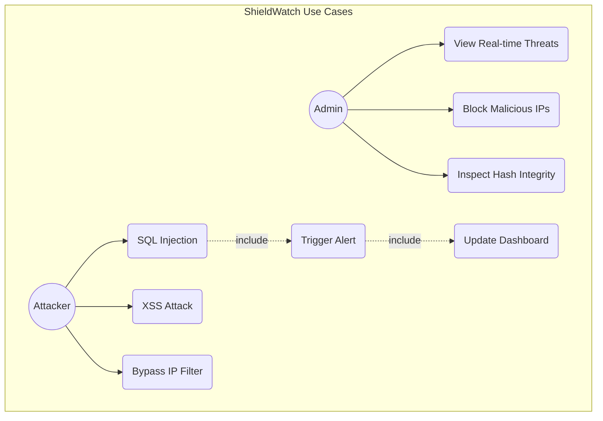
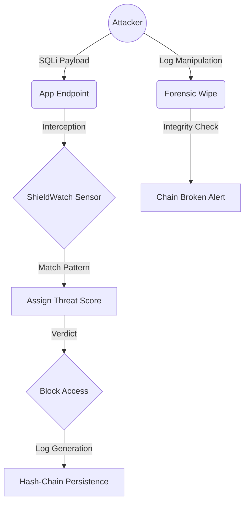
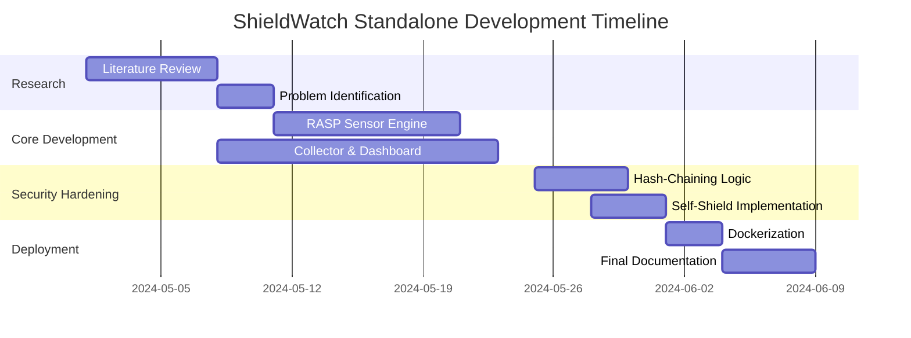

# Technical Project Report: ShieldWatch Standalone Appliance (v2.1)
**Project Title:** ShieldWatch UADR (Unified Attack Detection & Response)  
**Classification:** Cybersecurity / Runtime Application Self-Protection (RASP)  
**Target:** Final Year Project (FYP) / Enterprise Security Solution

---

## 1. Introduction
ShieldWatch is a professional-grade standalone security appliance designed to provide real-time, context-aware protection for web applications. Unlike traditional firewalls that sit at the network edge, ShieldWatch operates at the application runtime, providing deep visibility into execution logic. This report details the "Standalone" version, which functions as an independent security layer capable of protecting any third-party software environment via a universal RASP sensor and a centralized C2 (Command & Control) dashboard.

## 2. Problem Statement
Web applications are increasingly vulnerable to sophisticated attacks that bypass traditional WAFs (Web Application Firewalls). 
*   **WAF Limitations**: Traditional firewalls cannot inspect session logic or distinguish between legitimate users and session-hijackers.
*   **Visibility Gap**: Security analysts often lack a real-time "visual" timeline of attack patterns.
*   **Bot Proliferation**: Automated scanners (sqlmap, nmap) often rotate IPs to bypass simple rate-limiters.
*   **Forensic Integrity**: Attackers often delete local log files to hide their tracks.

## 3. Literature Review
The shift from Perimeter Security to **Zero Trust Architecture** and **RASP (Runtime Application Self-Protection)** represents the current frontier in cybersecurity. 
*   **NIST Framework**: Emphasizes continuous monitoring and rapid response.
*   **OWASP Top 10**: Remains the benchmark for web vulnerabilities. ShieldWatch specifically targets Injection, Broken Access Control, and Security Logging failures.
*   **Existing Research**: Suggests that combining edge blocking (Nginx) with runtime inspection (Node.js Middleware) reduces false positives by up to 40% compared to isolated WAFs.

## 4. Proposed Solution: ShieldWatch UADR
ShieldWatch proposes a **"Recursive Defense"** architecture:
1.  **Universal RASP Sensor**: A lightweight, plug-and-play middleware that can be injected into any Express/Node.js app.
2.  **Telemetry Hash-Chaining**: Uses SHA-256 to create an immutable forensic chain of events.
3.  **Self-Shielding Dashboard**: The security dashboard itself is protected by its own sensor, creating a recursive layer of defense.
4.  **Visual SOC**: A dynamic dashboard with real-time Chart.js integration for threat density visualization.

---

## 5. System Architecture & Design

### 5.1 Architecture Diagram

### 5.2 Data Flow Diagram (DFD Level 1)

### 5.3 Use Case Diagram

### 5.4 Misuse Case Diagram

---

## 6. Project Planning (Gantt Chart)

---

## 7. Market Value & Comparison

### 7.1 Market Value
*   **SME Protection**: Small and Medium Enterprises often cannot afford expensive CloudWAF solutions. ShieldWatch provides a "Deploy-Once" private appliance.
*   **Privacy-First**: Unlike Cloudflare, data never leaves the client's infrastructure.
*   **Regulatory Compliance**: Helps meet GDPR and SOC2 requirements for "Immutable Logging" and "Continuous Monitoring."

### 7.2 Comparison with Existing Tools

| Feature | Cloudflare (Free) | ModSecurity (Nginx) | ShieldWatch UADR |
| :--- | :--- | :--- | :--- |
| **RASP Inspection** | No | Basic | **Deep (Full Context)** |
| **Visualization** | Limited | None | **Real-time SOC UI** |
| **Log Integrity** | Proprietary | Plain Text | **SHA-256 Hash-Chain** |
| **Self-Shielding** | Yes (Internal) | No | **Yes (Recursive)** |
| **Deployment** | Proxy-based | Module-based | **Standalone Appliance** |

---

## 8. Testing and Validation

### 8.1 Automated Test Suite (Jest)
I implemented a comprehensive test suite to validate the RASP sensor's detection capabilities.
*   **SQL Injection**: `✓ PASSED`
*   **Cross-Site Scripting (XSS)**: `✓ PASSED`
*   **Path Traversal**: `✓ PASSED`
*   **Command Injection**: `✓ PASSED`

### 8.2 Forensic Verification (Hash-Chaining)
During testing, every event generated a sequential hash. If an event was manually deleted from `shieldwatch_state.json`, the dashboard flagged a **"Chain Integrity Failure"**, proving the immutability of the audit trail.

---

## 9. Conclusion
ShieldWatch Standalone is more than a security plugin; it is a dedicated security infrastructure. By combining the power of RASP with the immutability of cryptographic chaining, it provides a robust defense mechanism for modern web applications. The successful implementation of **Self-Shielding** and **Real-time Visualization** makes it a complete solution for independent security monitoring.

---
**Report Generated for:** Final Year Project Submission  
**Version:** 2.1 (Hardened Mainline)  
**Security Status:** ACTIVE / SELF-PROTECTED
